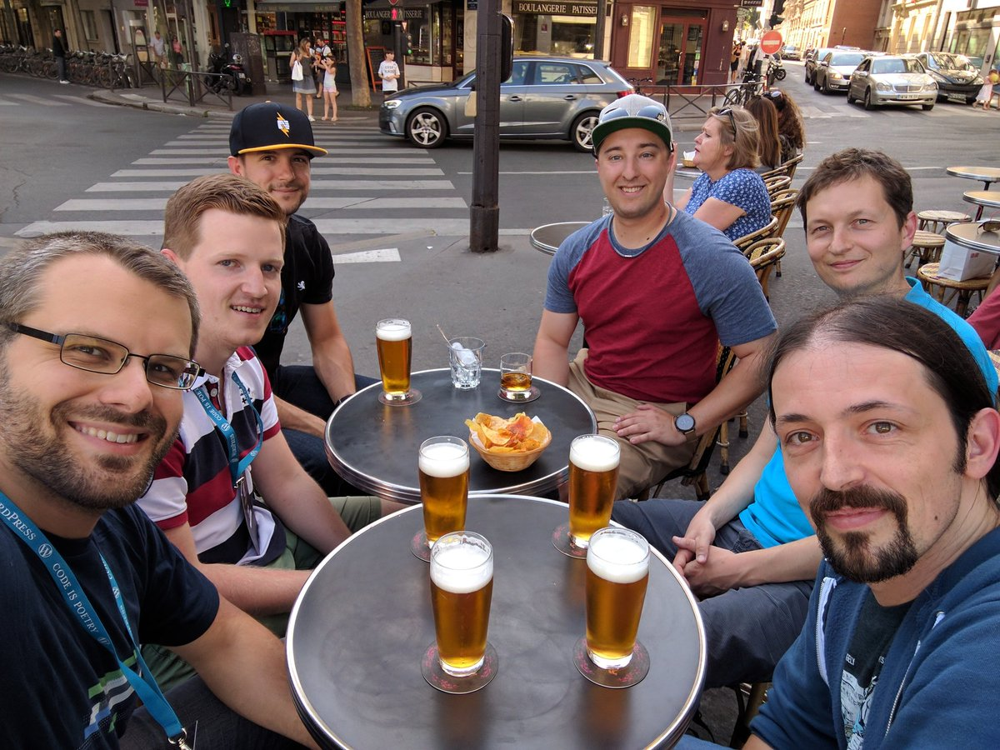

[WordCamp US 2019](https://2019.us.wordcamp.org/) will be bittersweet as it will be the last WordCamp I have planned for the foreseeable future and my last day at [Pantheon](https://pantheon.io/).

It has been almost 4 years since I joined the Developer Relations team at Pantheon and I have grown so much, personally and professionally, during that time.

I took the role initially to get out of my comfort zone and develop new skills such as public speaking, more direct client engagement, and helping developers improve their workflow. I still worked on code quite a bit but I worked as much, if not more, with people.

Reflecting back, I accomplished those goals and so much more. Pantheon gave me the chance to experience being on a new and growing DevRel team. That team was made up of so many amazing people, all of whom I will miss dearly.

I will also miss being involved in the WordPress community in-person. I have been privileged to be able to attend dozens of events during my tenure at Pantheon.

The trip I will remember the most is WordCamp Europe 2017 in Paris. It was the first time I had been involved enough in the community to be invited to the community summit – an experience I will never forget.

There are many friends I have made along the way and I regularly looked forward to seeing many people in the community in-person at events. Know that I enjoyed the time we got to spend together and that we will find other ways to keep in touch.

That being said, if you will be at WordCamp US do make a point to come find me and chat in-person. I’d love to catch up face to face while we have the opportunity to do so. I’ll be in St. Louis on Thursday, Friday, and Saturday.

By now you are probably asking what’s next for me after Pantheon. I’m excited to say I’ll be joining [Fox](https://www.fox.com/), working on the Consumer and Products Engineering Team as Lead Test Automation Engineer.

I am excited about the opportunity, and challenge, to take the skills I have developed around continuous integration (CI) and automated testing and apply them to new projects I’m also looking forward to getting to know a new team and continuing to grow.