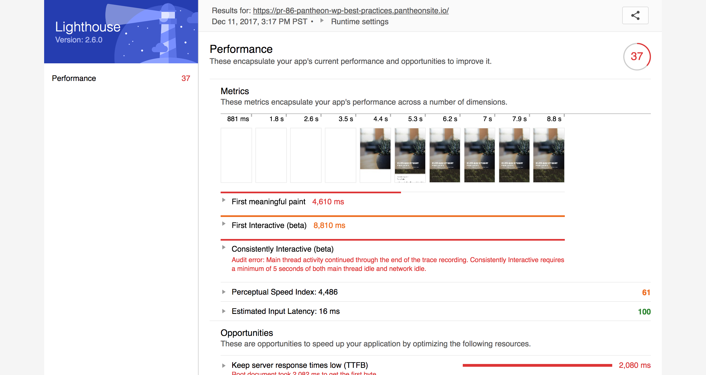
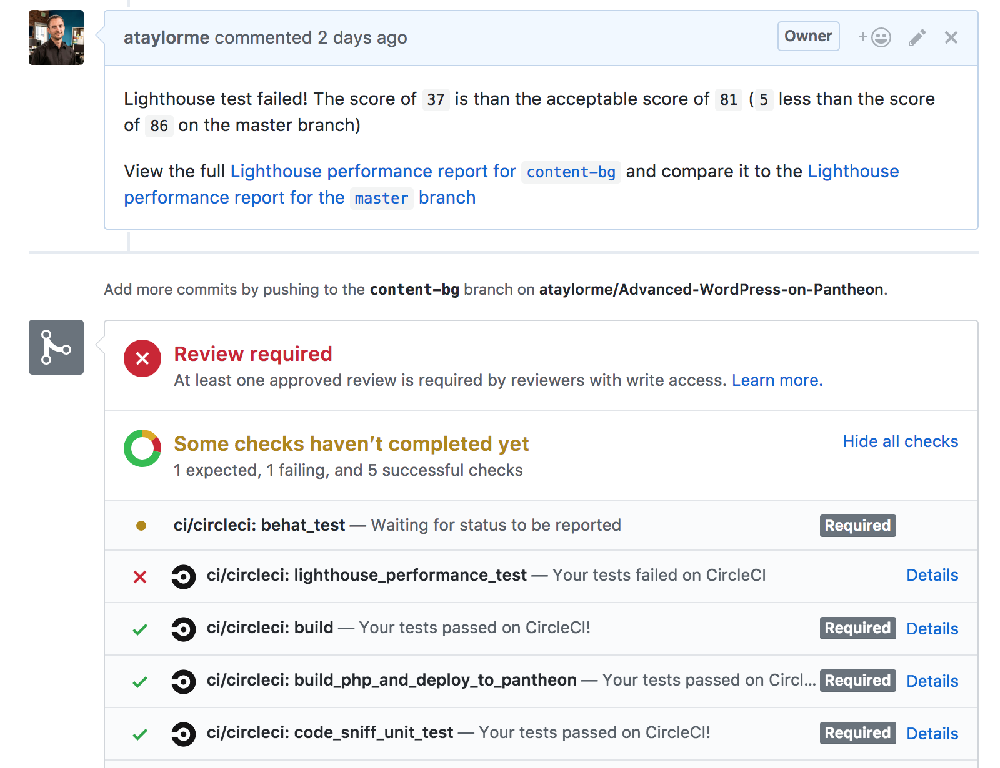

In December I stopped by the Google booth at [WordCamp US 2017](https://2017.us.wordcamp.org/) and got to see their new site auditing tool - [Lighthouse](https://developers.google.com/web/tools/lighthouse/).

> Lighthouse is an open-source, automated tool for improving the quality of web pages. ... It has audits for performance, accessibility, progressive web apps, and more.

It generates some really useful reports in both HTML format, shown below, as well as JSON. The HTML reports are great for people and the JSON data is easily usable by other scripts.

I was really intrigued and started to think of practical applications. I settled on running the performance audit for all new pull requests and blocking merging if the request lowered the score more than an acceptable level of tolerance. For me this was 5 points less than the score in production.

Lighthouse has a Chrome extension but I chose to add it to my CI process using the [npm package](https://www.npmjs.com/package/lighthouse). This requires headless Chrome to be installed, which I did inside of a [custom Docker image](https://github.com/ataylorme/docker-node-Advanced-WordPress-on-Pantheon/tree/lighthouse).

One of the issues I noticed using headless Chrome and the command line version of Lighthouse is that the performance scores returned were unusually high, especially when compared to the Chrome extension. I opened [an issue](https://github.com/GoogleChrome/lighthouse/issues/4003) and it turned out to be documented - I just missed that it. 

It turned out that headless Chrome did not support network throttling, which Lighthouse uses in the performance report. This was a [known issue](https://github.com/GoogleChrome/lighthouse/issues/2675) and something I thought would be a blocker as I wanted performance tests with network throttling to more accurately simulate user perceived performance.

One of the things that really stood out to me was the kindness and patience of the Lighthouse team. They were quick to respond, point me to the docs and show related issues. I would like to give special props to [Eric Bidelman](https://github.com/ebidel). Working in a similar role myself, supporting developers using a product, I appreciate the great job he is doing - thanks Eric!

 Once [the Chrome bug](https://bugs.chromium.org/p/chromium/issues/detail?id=728451) was fixed the Lighthouse team added support for network throttling when using Chrome `63` or later.

With that blocker removed I carried on. My existing CI process already created a new environment when pull requests are created. I simply added a new job that takes the Lighthouse performance score on that environment as well as production and compares the two. If the score in the new environment is more than 5 points less than what is in production the job fails. Finally, I save the reports from Lighthouse and place a comment on the pull request. The result looks like this:

If you are interested in viewing the source code you can find it on GitHub at [ataylorme/Advanced-WordPress-on-Pantheon](https://github.com/ataylorme/Advanced-WordPress-on-Pantheon/). I use GitHub and Circle CI 2.0 but this can easily be ported to other services as the majority of the logic is in [this bash script](https://github.com/ataylorme/Advanced-WordPress-on-Pantheon/blob/master/.circleci/lighthouse-performance-test.sh).